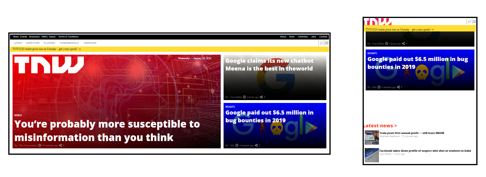

# BUILDING WITH RESPONSIVE DESIGN

> In this project, we got the chance to build a responsive website. We’ll be cloning [The Next Web](http://thenextweb.com/), a tech-focused magazine which uses media queries to gracefully degrade their site as the window size is reduced.

## Built With

- HTML5/CSS3
- Visual Studio Code
- The Stickler Linter
- Nu HTML Validator

## Live Demo

[Live Demo Link](https://rawcdn.githack.com/Dandush03/Building-with-Responsive-Design/5004f561a9b0e502e7f3c4450a4760ad227826a6/index.html)

## Getting Started

**The webpage is only a clone. None of the elements in it really work. It is only to showcase our HTML and CSS coding abilities.**

## Authors

**Danie Laloush**
- Github: [@Dandush03](https://github.com/Dandush03)
- Twitter: [@d_laloush](https://twitter.com/d_laloush)
- Linkedin: [Daniel Laloush](https://www.linkedin.com/in/daniel-laloush-0a7331a9) check what I'm talking about!

**Oscar Mier**
- Github: [@voscarmv](https://github.com/voscarmv)
- Twitter: [@voscarmv](https://twitter.com/voscarmv)
- Linkedin: [Oscar Mier](https://www.linkedin.com/in/oscar-mier-072984196/) 

## 🤝 Contributing

Contributions, issues and feature requests are welcome!

Feel free to check the [issues page](./issues/).

## Show your support

Give a ⭐️ if you like this project!

## Acknowledgments

- Hat tip to anyone whose code was used
- Thanks to Microverse!
- Thanks to The Next Web for letting us clone it's homepage!

## 📝 License

This project is [MIT](lic.url) licensed.
